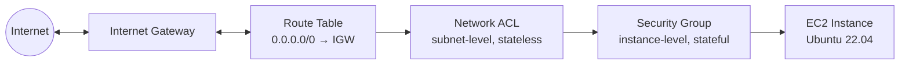

# AWS Cloud Support Lab

Hands-on AWS lab work focused on operating, troubleshooting, and securing cloud infrastructure — built as part of my transition into a Cloud Support Engineer role.

The focus here isn't "I completed a course." It's: build something real, break it on purpose, diagnose it like an incident, fix it, and document exactly how.

## Structure

- `incidents/` — documented incidents following a Problem → Impact → Investigation → Root Cause → Resolution → Prevention format, the way an on-call engineer would write a postmortem.

## Architecture

VPC: `10.0.0.0/16`, public subnet `10.0.1.0/24`. Traffic must pass the route table (does a path exist at all?), then the NACL (stateless, subnet-wide), then the Security Group (stateful, instance-specific) to reach the instance — INC-002, INC-003, and INC-001 each broke a different layer of this same chain.

## Incidents

| ID | Title | Summary |
|---|---|---|
| [INC-001](incidents/INC-001-ssh-access-loss.md) | SSH Access Loss After Security Group Rule Revocation | Diagnosed and resolved a self-induced loss of SSH access by tracing it to a revoked Security Group ingress rule, distinguishing a firewall-level block from an application-level failure. |
| [INC-002](incidents/INC-002-route-table-connectivity-loss.md) | Total Loss of Internet Connectivity After Route Table Default Route Deletion | Traced a full loss of subnet connectivity to a deleted default route, isolating it from a Security Group issue by checking layers in order (instance → routing). |
| [INC-003](incidents/INC-003-nacl-ssh-block.md) | SSH Access Blocked by Network ACL Deny Rule | Diagnosed a stateless NACL deny rule taking precedence over the default allow rule by rule number, after ruling out Security Group and route table causes. |
| [INC-004](incidents/INC-004-s3-accessdenied.md) | S3 AccessDenied Due to Missing IAM Policy | Diagnosed and resolved an AccessDenied error for a new IAM user by identifying the missing S3 permission and attaching a least-privilege managed policy. |
| [INC-005](incidents/INC-005-ec2-unauthorizedoperation.md) | EC2 UnauthorizedOperation Due to Missing IAM Policy | Confirmed EC2 permissions are independent from S3 permissions for the same IAM identity, then resolved the gap with a scoped read-only policy. |
| [INC-006](incidents/INC-006-ebs-snapshot-recovery.md) | Simulated Data Loss and Recovery via EBS Snapshot | Validated an EBS backup/restore path end-to-end, including diagnosing a wrong-device mount caused by NVMe device renaming on attach. |
| [INC-007](incidents/INC-007-ami-autoscaling.md) | Validating Self-Healing Infrastructure via Auto Scaling | Verified an Auto Scaling Group automatically replaced a terminated instance with a healthy, fully-functional one, with no manual intervention. |
| [INC-008](incidents/INC-008-alb-high-availability.md) | Validating High Availability via Application Load Balancer | Verified an ALB continued routing 100% of traffic to a healthy instance after terminating its sibling, with only a brief health-check detection window. |

## Stack

AWS (EC2, VPC, Security Groups, IAM), AWS CLI, Linux (Ubuntu), PowerShell

## Notes

All infrastructure in this repo is built and torn down within the AWS Free Tier. Cost controls (AWS Budgets) are configured before any resource is created.
