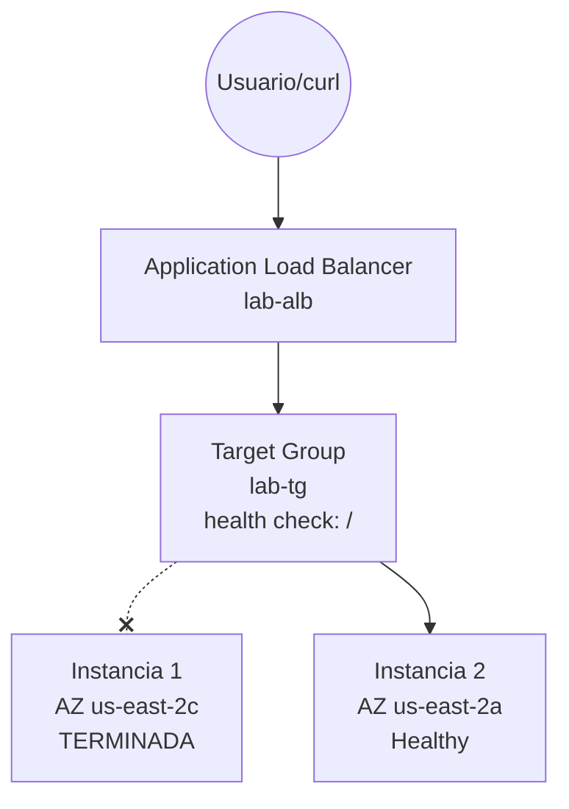

# INC-008 — Validating High Availability via Application Load Balancer

## Environment
- Two EC2 instances (Ubuntu 22.04, t3.micro) running nginx, each in a different Availability Zone (`us-east-2c` and `us-east-2a`), each serving a distinguishable index.html
- Application Load Balancer (`lab-alb`) spanning both subnets, with a Target Group (`lab-tg`) and an HTTP:80 Listener forwarding to it
- Target Group health check on path `/`

## Problem
Simulated scenario: one of two instances behind a load balancer fails completely (terminated). The goal is to validate that the application keeps serving traffic with no visible downtime to the end user.

## Impact
None, by design — that's the point of the exercise. A brief detection window exists (health checks need consecutive failures before marking a target unhealthy), during which some requests may fail, but overall availability is preserved.

## Architecture



## Investigation / Procedure
1. Confirmed both targets were `healthy` in the Target Group before testing:
   ```
   aws elbv2 describe-target-health --target-group-arn <tg-arn> --profile personal
   ```
2. Retrieved the ALB's public DNS name (the single entry point — clients never hit instance IPs directly):
   ```
   aws elbv2 describe-load-balancers --names lab-alb --query "LoadBalancers[0].DNSName" --output text --profile personal
   ```
3. Confirmed load balancing was actually happening (not just configured) by sending repeated requests and observing the response alternate between both instances:
   ```
   1..6 | ForEach-Object { (curl -UseBasicParsing http://<alb-dns>).Content }
   ```
   Result: alternated cleanly between "INSTANCIA 1" and "INSTANCIA 2" across 6 requests.
4. Terminated one instance directly, simulating an unrecoverable failure:
   ```
   aws ec2 terminate-instances --instance-ids <instance-1-id> --profile personal
   ```
5. Immediately re-ran the same 6-request loop. The first couple of requests returned `504 Gateway Time-out` — expected, since the health check requires consecutive failed checks before removing a target from rotation, so there's a brief window where the ALB still attempts to route to the now-dead instance.
6. After that detection window, `describe-target-health` showed only the surviving instance in the Target Group's response — the terminated one had dropped out of the list entirely (not just marked unhealthy, since it no longer exists).
7. Re-ran the 6-request loop again: all 6 requests returned `200 OK` with "INSTANCIA 2", zero errors.

## Root Cause
N/A (planned resilience exercise). The transient `504` errors immediately after termination are an expected characteristic of health-check-based failover, not a misconfiguration — there is an inherent detection delay between a target failing and the load balancer confirming and acting on it.

## Resolution
No manual resolution needed — the ALB's built-in health checking automatically removed the failed instance from rotation and continued routing 100% of traffic to the healthy one.

## Prevention
- The brief `504` window during detection is a real limitation to plan around, not eliminate — tuning the health check's interval and unhealthy threshold (fewer/faster checks) can shrink this window, at the cost of being more sensitive to transient blips.
- This exercise used manually-created instances, not an Auto Scaling Group — the failed instance was never replaced, only routed around. Combining an ASG with the Target Group (instead of standalone instances) would provide both failover (via the ALB) and self-healing (via the ASG replacing the lost instance) — the two mechanisms are complementary, not redundant with each other.

## What I'd Do Differently in Production
Attach the Target Group to an Auto Scaling Group instead of manually-managed instances, so capacity is restored automatically after a failure rather than permanently running at reduced capacity until someone notices and manually launches a replacement.
