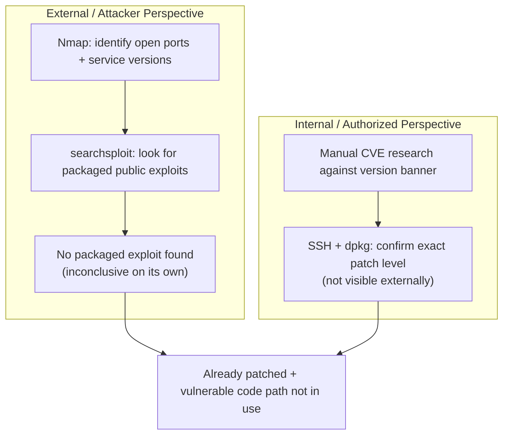

# INC-009 — External Vulnerability Audit: nginx and OpenSSH

## Environment
- Target: EC2 instance (Ubuntu 22.04 LTS) running nginx and OpenSSH, publicly reachable
- Attacker perspective: Kali Linux VM, no credentials, external network
- Defender/owner perspective: SSH access with the instance's key pair, used only for verification (not part of the simulated attack)

## Problem
Proactive security audit: identify what an unauthenticated external party could learn about this server's exposed services, and whether any of it represents a real, exploitable risk.

## Impact
None (no actual compromise) — this was a planned audit, not a response to a detected incident. Framed as an incident because the workflow (recon → assess → verify → conclude) mirrors how a real vulnerability finding would be handled.

## Audit Flow



## Investigation / Procedure

### 1. External reconnaissance (attacker perspective, no credentials)
```
nmap <target-ip>
nmap -p 22,80 <target-ip>
nmap -sV -sC -p 22,80 <target-ip>
```
Findings:
- Port 22/tcp open — OpenSSH 8.9p1 Ubuntu 3ubuntu0.17
- Port 80/tcp open — nginx 1.18.0 (Ubuntu)
- 998 other ports reported as `filtered` (not `closed`) — the Security Group drops unsolicited traffic silently rather than actively rejecting it, consistent with a default-deny configuration rather than an explicit reject rule.

### 2. Exploit availability search (attacker perspective)
```
searchsploit -u
searchsploit nginx 1.18.0
searchsploit openssh 8.9
```
Updated the local Exploit-DB copy first to rule out a stale database producing a false negative. Both searches returned no exploits, shellcodes, or papers.

**Note on interpreting this result:** "no results" in Exploit-DB does not mean "no vulnerabilities exist" — it means no public, packaged exploit is indexed in that specific database for these version strings. A real vulnerability can exist without a ready-to-run public PoC.

### 3. Manual CVE research (supplementing the exploit-database search)
Searched Ubuntu's official security tracker for nginx 1.18.0 directly, since the version banner alone doesn't reveal the exact patch level. Found CVE-2026-42945 (heap buffer overflow in `ngx_http_rewrite_module`, CVSS 9.2 Critical, publicly exploited/KEV), fixed for Ubuntu 22.04 LTS in package version `1.18.0-6ubuntu14.11`.

### 4. Internal verification (owner perspective — confirming, not attacking)
Connected via SSH (authorized access, not part of the simulated external attack) to check the exact installed package version, since Ubuntu backports security fixes without bumping the base version number (`1.18.0` stays the same; only the suffix changes):
```
dpkg -l | grep nginx
```
Result: `1.18.0-6ubuntu14.x` (patch suffix generalized here for hygiene — a specific build fingerprint isn't worth leaving in a public document long-term) — confirmed to be a later patch revision than the version that fixed CVE-2026-42945 (`.11`). Confirmed not vulnerable to this CVE.

Additionally, the vulnerable code path (`rewrite` directives combined with unnamed PCRE captures) is not present in this server's configuration, which serves a static `index.html` with default settings — a second, independent reason the CVE wouldn't apply even on an unpatched version.

## Root Cause
N/A (proactive audit, not a failure). No exploitable vulnerability was confirmed.

## Resolution
No remediation needed — the one credible CVE identified for this nginx version was already patched, and the vulnerable configuration path wasn't in use regardless.

## Prevention
- Don't rely on Nmap's version banner alone to judge patch status on Debian/Ubuntu-family systems — the base version number doesn't change when security patches are backported. Always confirm the exact installed package version via the package manager before concluding something is (or isn't) vulnerable.
- A "no exploit found" result from a single tool (Exploit-DB/searchsploit) isn't sufficient evidence of safety — cross-check against the OS vendor's own security tracker (Ubuntu Security Notices, in this case), which is authoritative for patch status regardless of public exploit availability.

## What I'd Do Differently in Production
Automate this kind of check instead of doing it manually per-host — tools like `unattended-upgrades` (to auto-apply security patches) combined with a vulnerability scanner (e.g., AWS Inspector, which scans EC2 instances against known CVE databases automatically) would catch this continuously, rather than relying on someone manually cross-referencing versions after the fact.
